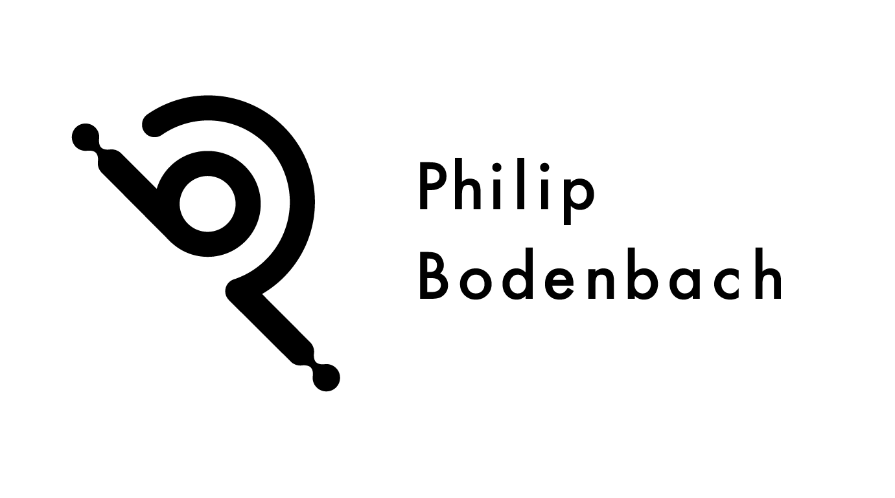

  <picture>
    <source
      srcset="assets/logo/pb_Logos_grau.png"
      media="(prefers-color-scheme: dark)"
    />
    <source
      srcset="assets/logo/pb_Logos_schwarz.png"
      media="(prefers-color-scheme: light)"
    />
    
  </picture>

## Philip Bodenbach

Freelance Software Engineer, Software Architect and Full Stack Web Developer based in Germany.

## About

I'm a freelance software engineer and software architect from Germany.

I've been developing software since 1996 and have been working as an independent consultant since 2007.

My work ranges from custom business applications and backend systems to software architecture, APIs and modern web applications with TypeScript and JavaScript.

I focus on building maintainable software, solving complex technical problems and supporting software projects over the long term.

Today I'm also exploring modern systems programming with Rust and building open-source software such as Werk1112.

## Featured Project

### [Werk1112](https://github.com/philipbodenbach/werk1112)

> A local-first inference router for modern AI models written in Rust.

Werk1112 focuses on local inference and OpenAI-compatible APIs. It is built as a practical Rust-based routing layer for applications that need to work with modern model runtimes while keeping local workflows first.

[Repository](https://github.com/philipbodenbach/werk1112) · [Project Website](https://philipbodenbach.github.io/werk1112/)

## Technologies

| Area | Technologies |
| --- | --- |
| Languages | Rust, PHP, TypeScript, JavaScript |
| Frontend | TypeScript, JavaScript, modern web applications |
| Backend | REST APIs, Backend Development, Full Stack Development |
| Data | MySQL, PostgreSQL, Redis |
| Infrastructure | Docker, Linux |
| Architecture | Software Architecture, Custom Software, Software Engineering |

## Professional Background

As an independent freelance developer, I support software projects through consulting, planning, development and long-term maintenance. My work covers custom software, web applications, backend systems and APIs.

## Links

- Website: [philipbodenbach.de](https://www.philipbodenbach.de)
- LinkedIn: [Philip Bodenbach](https://www.linkedin.com/in/philip-bodenbach)
- Werk1112: [github.com/philipbodenbach/werk1112](https://github.com/philipbodenbach/werk1112)
- Project Website: [philipbodenbach.github.io/werk1112](https://philipbodenbach.github.io/werk1112/)
- Email: [info@philipbodenbach.de](mailto:info@philipbodenbach.de)
