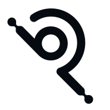

  

 

# Philip Bodenbach

Freelance Software Engineer, Software Architect and Full Stack Web Developer based in Germany.

I build professional software with a focus on backend development, web applications, APIs and custom software solutions. My work is grounded in more than two decades of practical software engineering across client projects, business applications and technical platforms.

## Current Focus

- Rust and modern backend engineering
- Local AI tooling and OpenAI-compatible interfaces
- Software architecture for maintainable systems
- Open source projects and pragmatic developer tooling

## Featured Project

### [Werk1112](https://github.com/philipbodenbach/werk1112)

> A local-first inference router for modern AI models written in Rust.

Werk1112 focuses on local inference and OpenAI-compatible APIs. It is built as a practical Rust-based routing layer for applications that need to work with modern model runtimes while keeping local workflows first.

[Repository](https://github.com/philipbodenbach/werk1112) · [Project Website](https://philipbodenbach.github.io/werk1112/)

## Technologies

| Area | Technologies |
| --- | --- |
| Languages | Rust, PHP, TypeScript, JavaScript |
| Backend | REST APIs, Backend Development, Full Stack Development |
| Data | MySQL, PostgreSQL, Redis |
| Infrastructure | Docker, Linux |
| Architecture | Software Architecture, Custom Software, Software Engineering |

## Professional Background

I have spent more than two decades building backend systems, web applications, APIs and custom software. Today I work as a freelance software engineer and software architect with a practical focus on clear technical decisions, maintainable implementation and reliable delivery.

## Links

- Website: [philipbodenbach.de](https://www.philipbodenbach.de)
- LinkedIn: [Philip Bodenbach](https://www.linkedin.com/in/philip-bodenbach)
- Werk1112: [github.com/philipbodenbach/werk1112](https://github.com/philipbodenbach/werk1112)
- Project Website: [philipbodenbach.github.io/werk1112](https://philipbodenbach.github.io/werk1112/)
- Email: [info@philipbodenbach.de](mailto:info@philipbodenbach.de)
